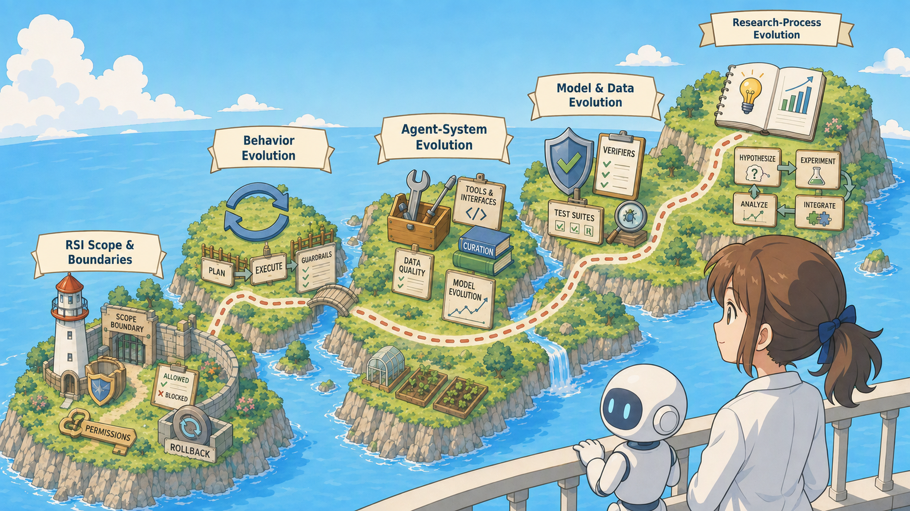

# Towards AI That Improves Itself: A Survey of Recursive Self-Improvement

> 📚 An **Awesome List** of Recursive Self-Improvement (RSI)-related papers (methods, systems, benchmarks, verifiers, and safety work) organized by **Background and Motivation**, the **RSI Framework**, **Evolution Families**, and **Frontier Dimensions**.

A curated, structured bibliography for *Towards AI That Improves Itself: A Survey of Recursive Self-Improvement*. The survey anchors RSI in **state inheritance** (an accepted improvement from one cycle becomes part of the starting state of a later improvement cycle) and distinguishes four stages: **evolution, self-evolution, meta-evolution, and recursive self-improvement**. **Minimal RSI denotes recursive state inheritance, while recursive progress denotes improvement of the improver itself; the latter is the stronger claim and the primary target of the survey.** The taxonomy below is therefore not an RSI certification list: many papers are included because they provide mechanisms, benchmarks, or safety evidence that can appear inside an RSI loop, not because they all support the same claim strength. Papers may appear in multiple sections when they contribute to multiple stages, targets, or evidence dimensions. Papers are organized along the survey's writing path: **Background and Motivation**, **RSI Framework** (the four stages and the Proposal → Feedback → Optimization loop), **Evolution Families** (what is evolved), and **Frontier Dimensions** (open problems).

<!-- badges -->

  
  
  

  

## Contents

1. [Background and Motivation](#1-background-and-motivation): Historical roots, bounded ML improvement, and recent RSI context
2. [RSI Framework](#2-rsi-framework): Four stages + Proposal / Feedback / Optimization + evidence boundaries
3. [Evolution Families](#3-evolution-families): Behavior, Agent-System, Model & Data, Research-Process; taxonomy is not certification
4. [Frontier Dimensions](#4-frontier-dimensions): Reliability → Generalization

## 1. Background and Motivation

These papers provide the conceptual and technical roots for the survey before the RSI framework and taxonomy.

### Historical Roots and RSI Motivation

| Date | Title | Paper |
|:----:|:------|:-----:|
| 1950 | Computing machinery and intelligence |   |
| 1966 | Speculations concerning the first ultraintelligent machine |   |
| 2008 | Artificial intelligence as a positive and negative factor in global risk |   |
| 2012 | Darwin among the machines: The evolution of global intelligence |   |
| 2014 | Superintelligence: Paths, Dangers, and Strategies |   |
| 2017 | Mastering the game of go without human knowledge |   |
| 2018 | A general reinforcement learning algorithm that masters chess, shogi, and Go through self-play |   |
| 2018 | The basic AI drives |   |

### Bounded Improvement in Machine Learning

| Date | Title | Paper |
|:----:|:------|:-----:|
| 1995 | Temporal difference learning and TD-Gammon |   |
| 2009 | Curriculum learning |   |
| 2012 | Practical bayesian optimization of machine learning algorithms |   |
| 2012 | Random search for hyper-parameter optimization |   |
| 2016 | Neural architecture search with reinforcement learning |  |
| 2017 | Model-agnostic meta-learning for fast adaptation of deep networks |   |
| 2017 | Population based training of neural networks |  |
| 2019 | AI-GAs: AI-generating algorithms, an alternate paradigm for producing general artificial intelligence |  |
| 2019 | Automated machine learning: methods, systems, challenges |   |
| 2019 | Neural architecture search: A survey |   |
| 2020 | Enhanced poet: Open-ended reinforcement learning through unbounded invention of learning challenges and their solutions |   |
| 2021 | Meta-learning in neural networks: A survey |   |
| 2022 | Star: Bootstrapping reasoning with reasoning |   |

### Agentic Foundations and Recent RSI Context

| Date | Title | Paper |
|:----:|:------|:-----:|
| 2022 | React: Synergizing reasoning and acting in language models |  |
| 2023 | Direct preference optimization: Your language model is secretly a reward model |   |
| 2023 | Judging LLM-as-a-Judge with MT-Bench and Chatbot Arena |   |
| 2023 | Reflexion: Language agents with verbal reinforcement learning |   |
| 2023 | Self-instruct: Aligning language models with self-generated instructions |   |
| 2023 | Toolformer: Language models can teach themselves to use tools |   |
| 2024 | Critic: Large language models can self-correct with tool-interactive critiquing |   |
| 2024 | SWE-agent: Agent-Computer Interfaces Enable Automated Software Engineering |   |
| 2025 | Aflow: Automating agentic workflow generation |   |
| 2025 | Automated design of agentic systems |   |
| 2025 | Gödel Agent: A Self-Referential Agent Framework for Recursive Self-Improvement |   |
| 2025 | LiveBench: A challenging, contamination-limited LLM benchmark |   |
| 2025 | Mle-bench: Evaluating machine learning agents on machine learning engineering |   |
| 2025 | OpenHands: An Open Platform for AI Software Developers as Generalist Agents |   |
| 2026 | Accelerating scientific discovery with Co-Scientist |   |
| 2026 | Darwin Gödel machine: open-ended evolution of self-improving agents |   |
| 2026 | Recursive Self-Improvement in AI: From Bounded Self-Refinement to Autonomous Research Loops |  |
| 2026 | Rethinking the evaluation of harness evolution for agents |   |
| 2026 | Self-Improvements in Modern Agentic Systems: A Survey |  |
| 2026 | Self-adapting language models |   |
| 2026 | The Economics of Recursive Self-Improvement |   |
| 2026 | Towards end-to-end automation of AI research |   |
| 2026 | When AI Builds Itself |   |
| 2026 | Large language models meet nlp: A survey |   |

## 2. RSI Framework

The survey distinguishes four evolution stages (**evolution, self-evolution, meta-evolution, and recursive self-improvement**) and anchors RSI in **state inheritance**. Evolution improves the current artifact; self-evolution retains an accepted improvement for later tasks or runs; meta-evolution changes the mechanism that proposes, evaluates, selects, or applies later improvements; and RSI requires a later improvement cycle to inherit and build on an accepted prior improvement. Recursive progress is the stronger claim that this inherited state improves the later improver itself. Papers in this section are organized by the Proposal → Feedback → Optimization loop, decomposed into its six components.

### Proposal Stage

#### Target Selection

##### Diagnosis & attribution

| Date | Title | Paper |
|:----:|:------|:-----:|
| 2026 | AgentDevel: Reframing Self-Evolving LLM Agents as Release Engineering |  |
| 2026 | AQuA: Recursively Self-Improving Quantitative Trading Research Agents |  |
| 2026 | Are LLMs Ready for Scientific Discovery? A Capability-Oriented Benchmark for AI Scientists |  |
| 2026 | AutoResearchBench: Benchmarking AI Agents on Complex Scientific Literature Discovery |  |
| 2026 | DarwinX: Evolving Agent Harnesses Through Natural Selection |  |
| 2026 | EvolveNet: Collaborative Harness Evolution for Agent Self-Improvement |  |
| 2026 | Frontis-MA1: Training an AI4AI model towards recursive self-improvement in machine learning engineering |  |
| 2026 | Knowledge-Centric Self-Improvement |  |
| 2026 | MetaVideoAgent: Automated Video-Agent Evolution for Long-Form Video Understanding |  |
| 2026 | One Interaction Is Worth a Thousand Guesses: Benchmarking the Interactive Capabilities of Deep Research Agents |  |
| 2026 | Recursive Harness Self-Improvement |  |
| 2026 | ResearchClawBench: A benchmark for end-to-end autonomous scientific research |  |
| 2026 | Self-Improving Large Language Models via Progressive Experience Evolution |  |

##### Granularity Selection

| Date | Title | Paper |
|:----:|:------|:-----:|
| 2023 | Promptbreeder: Self-referential self-improvement via prompt evolution |  |
| 2024 | TextGrad: Automatic "Differentiation" via Text |  |
| 2026 | AgentDevel: Reframing Self-Evolving LLM Agents as Release Engineering |  |
| 2026 | AI Harness Engineering: A Runtime Substrate for Foundation-Model Software Agents |  |
| 2026 | From Failed Trajectories to Reliable LLM Agents: Diagnosing and Repairing Harness Flaws |  |
| 2026 | Moss: Self-evolution through source-level rewriting in autonomous agent systems |  |
| 2026 | RSIBench-Data: Benchmarking data-centric research for recursive self-improvement |  |

##### Target Persistence

| Date | Title | Paper |
|:----:|:------|:-----:|
| 2023 | Voyager: An open-ended embodied agent with large language models |  |
| 2024 | Self-rewarding language models |  |
| 2024 | The AI Scientist: Towards Fully Automated Open-Ended Scientific Discovery |  |
| 2025 | Continuous self-improvement of large language models by test-time training with verifier-driven sample selection |  |
| 2026 | Adaptive Auto-Harness: Sustained Self-Improvement for Agentic System Deployment on Open-Ended Task Streams |  |
| 2026 | AREX: Towards a Recursively Self-Improving Agent for Deep Research |  |
| 2026 | Auditing Discovery Claims: A Two-Sided Criterion for Agentic Science, with the Negative Side Decidable |  |
| 2026 | Auto Research for Materials: Auditable AI-Scientist Workflows with Held-Out Transfer |  |
| 2026 | Bayesian-Agent: Posterior-Guided Skill Evolution for LLM Agent Harnesses |  |
| 2026 | Continual harness: Online adaptation for self-improving foundation agents |  |
| 2026 | DIVE: Unlocking Self-Improvement in Frozen Language Models Through Diversity-Driven Skill Evolution |  |
| 2026 | Harnessx: A composable, adaptive, and evolvable agent harness foundry |  |
| 2026 | Past-bench: Benchmarking the foundations of recursive self-improvement in personal agents |  |
| 2026 | PostTrainBench: Can LLM Agents Automate LLM Post-Training? |  |
| 2026 | Rehearse: Stepping Back from the Confidence Cliff in Self-Improving Autoresearch |  |
| 2026 | SBCO: Self-Supervised, Verifier-Grounded Harness Optimization For Planning Agents |  |
| 2026 | Skillopt: Executive strategy for self-evolving agent skills |  |
| 2026 | Skillrl: Evolving agents via recursive skill-augmented reinforcement learning |  |
| 2026 | The Scaling Laws of Skills in LLM Agent Systems |  |

##### Key challenge

| Date | Title | Paper |
|:----:|:------|:-----:|
| 2026 | Auditing Discovery Claims: A Two-Sided Criterion for Agentic Science, with the Negative Side Decidable |  |
| 2026 | Bad Memory: Evaluating Prompt Injection Risks from Memory in Agentic Systems |  |
| 2026 | From RLVR to RLSVR: Task Transformation Induces Self-Verifiable Rewards for Open-Ended LLM Self-Improvement |  |
| 2026 | Past-bench: Benchmarking the foundations of recursive self-improvement in personal agents |  |
| 2026 | Practice Makes Unsafe: Skill Misevolution in Self-Improving LLM Agents |  |
| 2026 | Self-Authored Verification Is Unreliable in Heuristic Self-Improving Agents |  |
| 2025 | DLPO: Towards a Robust, Efficient, and Generalizable Prompt Optimization Framework from a Deep-Learning Perspective. |   |
| 2025 | Hiagent: Hierarchical working memory management for solving long-horizon agent tasks with large language model |   |
| 2025 | Meta-rewarding language models: Self-improving alignment with llm-as-a-meta-judge |   |
| 2024 | Unlocking the capabilities of thought: A reasoning boundary framework to quantify and optimize chain-of-thought |   |
| 2026 | Drbench: A realistic benchmark for enterprise deep research |   |
| 2026 | Rbf++: Quantifying and optimizing reasoning boundaries across measurable and unmeasurable capabilities for chain-of-thought reasoning |   |

#### Candidate Generation

##### Proposal Design

| Date | Title | Paper |
|:----:|:------|:-----:|
| 2023 | Promptbreeder: Self-referential self-improvement via prompt evolution |  |
| 2024 | Self-play fine-tuning converts weak language models to strong language models |  |
| 2025 | Alphaevolve: A coding agent for scientific and algorithmic discovery |  |
| 2026 | AREX: Towards a Recursively Self-Improving Agent for Deep Research |  |
| 2026 | BenchEvolver: Frontier Task Synthesis via Solution-Centric Evolution |  |
| 2026 | D'ejaQ: Open-Ended Evolution of Diverse, Learnable and Verifiable Problems |  |
| 2026 | Evolutionary System Prompt Learning for Reinforcement Learning in LLMs |  |
| 2026 | Moss: Self-evolution through source-level rewriting in autonomous agent systems |  |
| 2026 | Rethinking Self-Evolving Agents: Do We Still Need Prescribed Optimization Pipelines? |  |
| 2026 | TTHE: Test-Time Harness Evolution |  |
| 2026 | Absolute zero: Reinforced self-play reasoning with zero data |   |
| 2023 | Language agent tree search unifies reasoning acting and planning in language models |  |
| 2023 | Tree of thoughts: Deliberate problem solving with large language models |   |
| 2026 | Gepa: Reflective prompt evolution can outperform reinforcement learning |   |
| 2023 | Adaplanner: Adaptive planning from feedback with language models |   |
| 2023 | Describe, explain, plan and select: interactive planning with llms enables open-world multi-task agents |   |
| 2023 | Reasoning with language model is planning with world model |   |
| 2024 | Adarefiner: Refining decisions of language models with adaptive feedback |   |
| 2024 | Statler: State-maintaining language models for embodied reasoning |   |
| 2025 | A multi-AI agent system for autonomous optimization of agentic AI solutions via iterative refinement and LLM-driven feedback loops |   |
| 2025 | Efficient Real-time Refinement of Language Model Text Generation |   |
| 2025 | Evoagentx: An automated framework for evolving agentic workflows |   |
| 2025 | Preflexor: Preference-based recursive language modeling for exploratory optimization of reasoning and agentic thinking |   |
| 2025 | S*: Test Time Scaling for Code Generation. |   |
| 2026 | Reassessing One-Round Test-Time Refinement for Code Generation |   |

### Feedback Stage

#### Execution Environment

##### Environment Execution

| Date | Title | Paper |
|:----:|:------|:-----:|
| 2023 | MLAgentBench: Evaluating Language Agents on Machine Learning Experimentation |  |
| 2024 | RE-Bench: Evaluating Frontier AI R&D Capabilities of Language Model Agents Against Human Experts |  |
| 2026 | A-Evolve-Training: Autonomous Post-Training of a 30B Model |  |
| 2026 | AutoTrainess: Teaching Language Models to Improve Language Models Autonomously |  |
| 2026 | BaT: Towards Self-Evolving Medical Research Agent with Stage Rubrics |  |
| 2026 | CLAP: Closed-Loop Training, Evaluation, and Release Control for Domain Agent Post-training |  |
| 2026 | Do Coding Agents Understand Least-Privilege Authorization? |  |
| 2026 | Frontis-MA1: Training an AI4AI model towards recursive self-improvement in machine learning engineering |  |
| 2026 | Mars: Modular agent with reflective search for automated ai research |  |
| 2026 | PostTrainBench: Can LLM Agents Automate LLM Post-Training? |  |
| 2026 | RSIBench-Data: Benchmarking data-centric research for recursive self-improvement |  |
| 2026 | Scaling Automatic Research Agents via World Models |  |
| 2026 | Synthetic sandbox for training machine learning engineering agents |  |
| 2026 | EnvHarness: Awakening Static Worlds for Agent Learning |  |

##### Long-Horizon Interaction

| Date | Title | Paper |
|:----:|:------|:-----:|
| 2025 | BoxingGym: Benchmarking progress in automated experimental design and model discovery |  |
| 2026 | ClawMark: A Living-World Benchmark for Multi-Turn, Multi-Day, Multimodal Coworker Agents |  |
| 2026 | VibeLifeBench: Can Your Life Agent Be Proactive and Persistent in a Living World? |  |
| 2020 | Alfworld: Aligning text and embodied environments for interactive learning |  |
| 2022 | Scienceworld: Is your agent smarter than a 5th grader? |   |
| 2023 | Intercode: Standardizing and benchmarking interactive coding with execution feedback |   |
| 2023 | Mind2web: Towards a generalist agent for the web |   |
| 2024 | Agentbench: Evaluating llms as agents |   |
| 2024 | Appworld: A controllable world of apps and people for benchmarking interactive coding agents |   |
| 2024 | Assistantbench: Can web agents solve realistic and time-consuming tasks? |   |
| 2024 | Cradle: Empowering foundation agents towards general computer control |  |
| 2024 | Long-horizon planning for multi-agent robots in partially observable environments |   |
| 2024 | Osworld: Benchmarking multimodal agents for open-ended tasks in real computer environments |   |
| 2024 | Tau-bench: A Benchmark for Tool-Agent-User Interaction in Real-World Domains |  |
| 2024 | The browsergym ecosystem for web agent research |  |
| 2024 | Weblinx: Real-world website navigation with multi-turn dialogue |  |
| 2024 | Webvoyager: Building an end-to-end web agent with large multimodal models |   |
| 2024 | WorkArena: How capable are web agents at solving common knowledge work tasks? |  |
| 2025 | Evoagent: Self-evolving agent with continual world model for long-horizon tasks |   |
| 2025 | MedAgentBench: a virtual EHR environment to benchmark medical LLM agents |   |
| 2026 | Osworld-mcp: Benchmarking mcp tool invocation in computer-use agents |   |
| 2024 | Swe-bench: Can language models resolve real-world github issues? |   |
| 2026 | Swe-bench goes live! |   |
| 2025 | Text2world: Benchmarking large language models for symbolic world model generation |   |

#### Verification Signal

##### Judge design

| Date | Title | Paper |
|:----:|:------|:-----:|
| 2023 | AI control: Improving safety despite intentional subversion |  |
| 2023 | Weak-to-strong generalization: Eliciting strong capabilities with weak supervision |  |
| 2024 | Llm critics help catch llm bugs |  |
| 2024 | Prover-verifier games improve legibility of llm outputs |  |
| 2025 | Efficient process reward model training via active learning |  |
| 2025 | EvilGenie: A reward hacking benchmark |  |
| 2025 | Towards self-evolving benchmarks: Synthesizing agent trajectories via test-time exploration under validate-by-reproduce paradigm |  |
| 2026 | Can LLM-as-a-Judge Reliably Verify Rubrics in Agentic Scenarios? |  |
| 2026 | EVOMAL: Self-Poisoning in Self-Evolving Coding Agents |  |
| 2026 | From RLVR to RLSVR: Task Transformation Induces Self-Verifiable Rewards for Open-Ended LLM Self-Improvement |  |
| 2026 | Judge, Retrieve, or Abstain: Uncertainty-Guarded LLM Judging with Provable Risk Guarantees |  |
| 2026 | Library drift: Diagnosing and fixing a silent failure mode in self-evolving LLM skill libraries |  |
| 2026 | MAS-ProVe: Understanding the process verification of multi-agent systems |  |
| 2026 | Reasoning Jury: Multi-Model Consensus for Evaluating Reasoning Traces |  |
| 2026 | Recursive Self-Evolving Agents via Held-Out Selection |  |
| 2026 | Reward hacking benchmark: measuring exploits in LLM agents with tool use |  |
| 2026 | RSIBench-Data: Benchmarking data-centric research for recursive self-improvement |  |
| 2026 | SEAGym: An Evaluation Environment for Self-Evolving LLM Agents |  |
| 2026 | Self-Trained Verification for Training-and Test-Time Self-Improvement |  |
| 2026 | The Red Queen Gödel Machine: Co-Evolving Agents and Their Evaluators |  |
| 2026 | Two-Level Meta-Rubrics for Evaluating Open-Ended Generation: GAMUT, a Benchmark for Factual Completeness |  |
| 2026 | Who Grades the Grader? Co-Evolving Evaluation Metrics and Skills for Self-Improving LLM Agents |  |

##### Reference annotation

| Date | Title | Paper |
|:----:|:------|:-----:|
| 2025 | LifelongAgentBench: Evaluating LLM Agents as Lifelong Learners |  |
| 2025 | Towards self-evolving benchmarks: Synthesizing agent trajectories via test-time exploration under validate-by-reproduce paradigm |  |
| 2026 | AEVAL: From Anecdotal to Deterministic Testing for Agentic Skill Workflows |  |
| 2026 | AgentLens: Revealing The Lucky Pass Problem in SWE-Agent Evaluation |  |
| 2026 | Claw-Eval-Live: A Live Agent Benchmark for Evolving Real-World Workflows |  |
| 2026 | SEAGym: An Evaluation Environment for Self-Evolving LLM Agents |  |

##### Rubric creation

| Date | Title | Paper |
|:----:|:------|:-----:|
| 2025 | Rubric-conditioned LLM grading: Alignment, uncertainty, and robustness |  |
| 2026 | ARES: Automated Rubric Synthesis for Scalable LLM Reinforcement Learning |  |
| 2026 | EvoRubric: Self-Evolving Rubric-Driven RL for Open-Ended Generation |  |
| 2026 | Feedback-to-Rubrics: Can We Learn Expert Criteria from Inline Comments? |  |
| 2026 | From Holistic Evaluation to Structured Criteria: Rubrics Across the Evolving LLM Landscape |  |
| 2026 | From rubrics to reliable scores: Evidence-grounded text evaluation with llm judges |  |
| 2026 | Many Voices, One Reward: Multi-Role Rubric Generation for LLM Judging and Reward Modeling |  |
| 2026 | Rubric-as-Experts: Case-Specific MQM Rubrics for Translation Quality Evaluation |  |
| 2026 | RubricBench: Aligning model-generated rubrics with human standards |  |
| 2026 | Rubriceval: A rubric-level meta-evaluation benchmark for llm judges in instruction following |  |
| 2026 | Rubrics as an attack surface: Stealthy preference drift in LLM judges |  |
| 2026 | Rubrics on Trial: Evolving Rubrics from a Single Query via Synthetic Pairwise Evidence |  |
| 2026 | Step-wise rubric rewards for llm reasoning |  |
| 2026 | Support Vector Rubrics: Closing the Gap Between Self-Generated and Human Rubrics |  |

##### Key challenge

| Date | Title | Paper |
|:----:|:------|:-----:|
| 2026 | Reward under attack: Analyzing the robustness and hackability of process reward models |  |
| 2026 | Rubric Dropout: A Simple Way to Mitigate Reward Hacking in Rubric-as-Reward RL |  |
| 2026 | Self-Authored Verification Is Unreliable in Heuristic Self-Improving Agents |  |
| 2026 | The Blind Curator: How a Biased Judge Silently Disables Skill Retirement in Self-Evolving Agents |  |
| 2026 | Who Grades the Grader? Co-Evolving Evaluation Metrics and Skills for Self-Improving LLM Agents |  |
| 2024 | Gaia: a benchmark for general ai assistants |   |
| 2024 | Webarena: A realistic web environment for building autonomous agents |   |
| 2025 | Benchmarking large language models under data contamination: A survey from static to dynamic evaluation |   |
| 2024 | LLM-rubric: A multidimensional, calibrated approach to automated evaluation of natural language texts |   |
| 2025 | Do we need a detailed rubric for automated essay scoring using large language models? |   |
| 2026 | Automated refinement of essay scoring rubrics for language models via reflect-and-revise |   |
| 2026 | CDRRM: Contrast-Driven Rubric Generation for Reliable and Interpretable Reward Modeling |   |
| 2026 | Rubricrag: Towards interpretable and reliable llm evaluation via domain knowledge retrieval for rubric generation |   |
| 2026 | iruler: Intelligible rubric-based user-defined llm evaluation for revision |   |
| 2015 | The lean theorem prover (system description) |   |
| 2018 | AI safety via debate |  |
| 2023 | Artificial intelligence risk management framework (AI RMF 1.0) |   |
| 2023 | Selfcheckgpt: Zero-resource black-box hallucination detection for generative large language models |   |
| 2024 | Let's verify step by step |   |
| 2024 | Llms-as-judges: a comprehensive survey on llm-based evaluation methods |  |
| 2024 | Solving olympiad geometry without human demonstrations |   |
| 2025 | Rewardbench: Evaluating reward models for language modeling |   |

### Optimization Stage

#### Memory Update

##### Overview

| Date | Title | Paper |
|:----:|:------|:-----:|
| 2026 | Experience Graphs: The Data Foundation for Self-Improving Agents |  |
| 2026 | MEGA: Self-Evolving Agent Optimization Infrastructure via Wisdom Graph |  |
| 2026 | WikiSkill: Compiling Agent Experience into Persistent Knowledge for Skill Evolution |  |

##### Memory reuse

| Date | Title | Paper |
|:----:|:------|:-----:|
| 2025 | LifelongAgentBench: Evaluating LLM Agents as Lifelong Learners |  |
| 2026 | Bad Memory: Evaluating Prompt Injection Risks from Memory in Agentic Systems |  |
| 2026 | EVOMAL: Self-Poisoning in Self-Evolving Coding Agents |  |
| 2026 | Experience Graphs: The Data Foundation for Self-Improving Agents |  |
| 2026 | Library drift: Diagnosing and fixing a silent failure mode in self-evolving LLM skill libraries |  |
| 2026 | SEAGym: An Evaluation Environment for Self-Evolving LLM Agents |  |

##### Memory tracking

| Date | Title | Paper |
|:----:|:------|:-----:|
| 2025 | Towards self-evolving benchmarks: Synthesizing agent trajectories via test-time exploration under validate-by-reproduce paradigm |  |
| 2026 | AgentDevel: Reframing Self-Evolving LLM Agents as Release Engineering |  |
| 2026 | AREX: Towards a Recursively Self-Improving Agent for Deep Research |  |
| 2026 | Experience Graphs: The Data Foundation for Self-Improving Agents |  |
| 2026 | RSIBench-Data: Benchmarking data-centric research for recursive self-improvement |  |
| 2026 | SEAGym: An Evaluation Environment for Self-Evolving LLM Agents |  |

##### Memory writing

| Date | Title | Paper |
|:----:|:------|:-----:|
| 2023 | Memgpt: Towards llms as operating systems |  |
| 2023 | Voyager: An open-ended embodied agent with large language models |  |
| 2026 | Experience Graphs: The Data Foundation for Self-Improving Agents |  |
| 2026 | MEGA: Self-Evolving Agent Optimization Infrastructure via Wisdom Graph |  |
| 2026 | SkillMaster: Toward Autonomous Skill Mastery in LLM Agents |  |

##### Key challenge

| Date | Title | Paper |
|:----:|:------|:-----:|
| 2023 | Voyager: An open-ended embodied agent with large language models |  |
| 2026 | Bad Memory: Evaluating Prompt Injection Risks from Memory in Agentic Systems |  |
| 2026 | Library drift: Diagnosing and fixing a silent failure mode in self-evolving LLM skill libraries |  |
| 2026 | SEAGym: An Evaluation Environment for Self-Evolving LLM Agents |  |
| 2024 | Expel: Llm agents are experiential learners |   |
| 2026 | How memory management impacts llm agents: An empirical study of experience-following behavior |   |

#### Update Policy

##### Overview

| Date | Title | Paper |
|:----:|:------|:-----:|
| 2026 | PACEvolve++: Improving Test-time Learning for Evolutionary Search Agents |  |
| 2026 | Rethinking Self-Evolving Agents: Do We Still Need Prescribed Optimization Pipelines? |  |
| 2026 | SIA: Self Improving AI with Harness & Weight Updates |  |
| 2026 | The Optimizer Is the Agent: Reasoning-Driven Search across Prompts, Programs, and ML Workflows |  |

##### State Transition

| Date | Title | Paper |
|:----:|:------|:-----:|
| 2023 | AI control: Improving safety despite intentional subversion |  |
| 2026 | AgentDevel: Reframing Self-Evolving LLM Agents as Release Engineering |  |
| 2026 | CLAP: Closed-Loop Training, Evaluation, and Release Control for Domain Agent Post-training |  |
| 2026 | Do Coding Agents Understand Least-Privilege Authorization? |  |
| 2026 | Evo-harness: Context-to-harness skill compilation for self-evolving agents |  |
| 2026 | Experience Graphs: The Data Foundation for Self-Improving Agents |  |
| 2026 | Harness-R1: Learning to Edit Executable Runtime Harnesses from Agent Failure Trajectories |  |
| 2026 | HELIX: Model-Harness Co-evolution for Recursive Self-Improvement |  |
| 2026 | No Time Like the Present: Agentic Test-Time Training for LLM Agents |  |
| 2026 | Recursive Self-Evolving Agents via Held-Out Selection |  |
| 2026 | Rethinking Self-Evolving Agents: Do We Still Need Prescribed Optimization Pipelines? |  |
| 2026 | RSIBench-Data: Benchmarking data-centric research for recursive self-improvement |  |
| 2026 | SEAGym: An Evaluation Environment for Self-Evolving LLM Agents |  |
| 2026 | SIA: Self Improving AI with Harness & Weight Updates |  |
| 2026 | SkillMaster: Toward Autonomous Skill Mastery in LLM Agents |  |

##### Update Rule

| Date | Title | Paper |
|:----:|:------|:-----:|
| 2026 | A-Evolve-Training: Autonomous Post-Training of a 30B Model |  |
| 2026 | AutoTrainess: Teaching Language Models to Improve Language Models Autonomously |  |
| 2026 | Cooperative Coevolution for Resource-Constrained Agentic LLM Post-Training |  |
| 2026 | Evo-harness: Context-to-harness skill compilation for self-evolving agents |  |
| 2026 | EvoDrive: Pareto Evolution for Safety-Critical Autonomous Driving via Self-Improving LLM Agents |  |
| 2026 | EXG: Self-Evolving Agents with Experience Graphs |  |
| 2026 | Experience Graphs: The Data Foundation for Self-Improving Agents |  |
| 2026 | ExpGraph: Model-Agnostic Experience Learning with Graph-Structured Memory for LLM Agents |  |
| 2026 | Frontis-MA1: Training an AI4AI model towards recursive self-improvement in machine learning engineering |  |
| 2026 | Harness-R1: Learning to Edit Executable Runtime Harnesses from Agent Failure Trajectories |  |
| 2026 | HELIX: Model-Harness Co-evolution for Recursive Self-Improvement |  |
| 2026 | MEGA: Self-Evolving Agent Optimization Infrastructure via Wisdom Graph |  |
| 2026 | Moss: Self-evolution through source-level rewriting in autonomous agent systems |  |
| 2026 | No Time Like the Present: Agentic Test-Time Training for LLM Agents |  |
| 2026 | PACEvolve++: Improving Test-time Learning for Evolutionary Search Agents |  |
| 2026 | Rethinking Self-Evolving Agents: Do We Still Need Prescribed Optimization Pipelines? |  |
| 2026 | Self-Improving Large Language Models via Progressive Experience Evolution |  |
| 2026 | SIA: Self Improving AI with Harness & Weight Updates |  |
| 2026 | SkillMaster: Toward Autonomous Skill Mastery in LLM Agents |  |
| 2026 | Skillrl: Evolving agents via recursive skill-augmented reinforcement learning |  |
| 2026 | The Optimizer Is the Agent: Reasoning-Driven Search across Prompts, Programs, and ML Workflows |  |
| 2026 | Falsifiable Release Gates for Self-Improving Systems: Standing Invariants at Scale |   |
| 2026 | Harness AgentTrace |   |
| 2026 | Introducing Harness Agent DLC: Extending Your SDLC to AI Agents |   |

## 3. Evolution Families

Four targets of RSI-related evolution, following the survey taxonomy. These categories identify what is being evolved; they do not certify that every listed method is an RSI system. Within each sub-category, papers are grouped by *Feedback Pattern*, *Optimization Loops*, and *RSI Target Scope*.

### Behavior Evolution

#### Output Self-Refine

##### Feedback Pattern: Critique and Reflection

| Date | Title | Paper |
|:----:|:------|:-----:|
| 2024 | Llm critics help catch llm bugs |  |
| 2025 | Agent-r: Training language model agents to reflect via iterative self-training |  |
| 2026 | EVE-Agent: Evidence-Verifiable Self-Evolving Agents |  |
| 2026 | Self-Evolving Agents with Anytime-Valid Certificates |  |

##### Optimization Loops: Reusable Critique

| Date | Title | Paper |
|:----:|:------|:-----:|
| 2025 | Agent-r: Training language model agents to reflect via iterative self-training |  |
| 2025 | LifelongAgentBench: Evaluating LLM Agents as Lifelong Learners |  |
| 2025 | Reflection-based memory for web navigation agents |  |
| 2025 | Truly self-improving agents require intrinsic metacognitive learning |  |
| 2026 | Bad Memory: Evaluating Prompt Injection Risks from Memory in Agentic Systems |  |
| 2026 | On the Fragility of Self-Improving Agents: Variance, Task Order, and Underspecification |  |
| 2026 | Phantom Gains: Auditing Self-Improvement Against a Measured Null |  |
| 2026 | Recursive Self-Evolving Agents via Held-Out Selection |  |
| 2026 | SEAGym: An Evaluation Environment for Self-Evolving LLM Agents |  |

##### RSI Target Scope: Solution Calibration

| Date | Title | Paper |
|:----:|:------|:-----:|
| 2023 | Dspy assertions: Computational constraints for self-refining language model pipelines |  |
| 2025 | LifelongAgentBench: Evaluating LLM Agents as Lifelong Learners |  |
| 2026 | PILOT in the Loop: Live Self-Improvement for Long-Horizon Agents |  |
| 2023 | Self-refine: Iterative refinement with self-feedback |   |
| 2024 | Chain-of-verification reduces hallucination in large language models |   |
| 2024 | Teaching large language models to self-debug |   |
| 2022 | Constitutional ai: Harmlessness from ai feedback |  |
| 2022 | Self-critiquing models for assisting human evaluators |  |
| 2024 | Selfcheck: Using llms to zero-shot check their own step-by-step reasoning |   |
| 2026 | The lighthouse of language: Enhancing llm agents via critique-guided improvement |   |
| 2023 | Can large language models really improve by self-critiquing their own plans? |  |
| 2023 | Learning from mistakes via cooperative study assistant for large language models |   |
| 2024 | In-context principle learning from mistakes |  |
| 2024 | Large language models cannot self-correct reasoning yet |   |
| 2024 | When can llms actually correct their own mistakes? a critical survey of self-correction of llms |   |
| 2026 | Self-Reference in Large Language Models: The Introspection Threshold for Recursive Self-Improvement |  |

#### State Optimization

##### Feedback Pattern: State and Action Link

| Date | Title | Paper |
|:----:|:------|:-----:|
| 2026 | MetaSkill-Evolve: Recursive Self-Improvement of LLM Agents via Two-Timescale Meta-Skill Evolution |  |
| 2026 | Skillrl: Evolving agents via recursive skill-augmented reinforcement learning |  |

##### Optimization Loops: Reused State

| Date | Title | Paper |
|:----:|:------|:-----:|
| 2026 | Bad Memory: Evaluating Prompt Injection Risks from Memory in Agentic Systems |  |

##### RSI Target Scope: State Types

| Date | Title | Paper |
|:----:|:------|:-----:|
| 2023 | Memgpt: Towards llms as operating systems |  |
| 2023 | Promptbreeder: Self-referential self-improvement via prompt evolution |  |
| 2023 | Voyager: An open-ended embodied agent with large language models |  |
| 2026 | Experience Graphs: The Data Foundation for Self-Improving Agents |  |
| 2026 | Self-Improving Large Language Models via Progressive Experience Evolution |  |
| 2026 | SkillMaster: Toward Autonomous Skill Mastery in LLM Agents |  |
| 2026 | WikiSkill: Compiling Agent Experience into Persistent Knowledge for Skill Evolution |  |

#### Test-Time Evolution

##### Feedback Pattern: Search Feedback

| Date | Title | Paper |
|:----:|:------|:-----:|
| 2025 | Efficient process reward model training via active learning |  |
| 2026 | CAFE: Self-Improving Search Agents Need Co-Evolving Feedback |  |
| 2026 | PACE-Bench: Benchmarking Physics Adaptation via Code Evolution in Dynamic Environments |  |
| 2026 | PACEvolve++: Improving Test-time Learning for Evolutionary Search Agents |  |

##### Optimization Loops: Reuse of Search Traces

| Date | Title | Paper |
|:----:|:------|:-----:|
| 2025 | Efficient process reward model training via active learning |  |
| 2026 | CAFE: Self-Improving Search Agents Need Co-Evolving Feedback |  |

##### RSI Target Scope: Search Target

| Date | Title | Paper |
|:----:|:------|:-----:|
| 2026 | PACEvolve++: Improving Test-time Learning for Evolutionary Search Agents |  |
| 2026 | Self-Evolving Agents with Anytime-Valid Certificates |  |
| 2022 | Automatic chain of thought prompting in large language models |  |
| 2022 | Self-consistency improves chain of thought reasoning in language models |  |
| 2024 | Tree-planner: Efficient close-loop task planning with large language models |   |
| 2026 | OMIBench: Benchmarking Olympiad-Level Multi-Image Reasoning in Large Vision-Language Models |   |
| 2026 | Towards reasoning era: A survey of long chain-of-thought for reasoning large language models |   |

### Agent-System Evolution

#### Workflow Evolution

##### Feedback Pattern: Workflow Search and Role Diversity

| Date | Title | Paper |
|:----:|:------|:-----:|
| 2025 | Flex: Continuous agent evolution via forward learning from experience |  |
| 2026 | AI Harness Engineering: A Runtime Substrate for Foundation-Model Software Agents |  |
| 2026 | Coral: Towards autonomous multi-agent evolution for open-ended discovery |  |
| 2026 | Evo-harness: Context-to-harness skill compilation for self-evolving agents |  |
| 2026 | Harnessing agentic evolution |  |
| 2026 | MAS-ProVe: Understanding the process verification of multi-agent systems |  |
| 2026 | Meta-harness: End-to-end optimization of model harnesses |  |
| 2026 | MetaEvo: A Meta-Optimization Framework for Experience-Driven Agent Evolution |  |
| 2026 | RSIBench-Data: Benchmarking data-centric research for recursive self-improvement |  |

##### Optimization Loops: Workflow Search and Promotion

| Date | Title | Paper |
|:----:|:------|:-----:|
| 2025 | Flex: Continuous agent evolution via forward learning from experience |  |
| 2025 | Towards self-evolving benchmarks: Synthesizing agent trajectories via test-time exploration under validate-by-reproduce paradigm |  |
| 2026 | AgentDevel: Reframing Self-Evolving LLM Agents as Release Engineering |  |
| 2026 | Evo-harness: Context-to-harness skill compilation for self-evolving agents |  |
| 2026 | Evolving Agents in the Dark: Retrospective Harness Optimization via Self-Preference |  |
| 2026 | From Failed Trajectories to Reliable LLM Agents: Diagnosing and Repairing Harness Flaws |  |
| 2026 | Harness Updating Is Not Harness Benefit: Disentangling Evolution Capabilities in Self-Evolving LLM Agents |  |
| 2026 | Harnessing agentic evolution |  |
| 2026 | Meta-harness: End-to-end optimization of model harnesses |  |
| 2026 | MetaEvo: A Meta-Optimization Framework for Experience-Driven Agent Evolution |  |
| 2026 | Recursive Self-Evolving Agents via Held-Out Selection |  |
| 2026 | SEAGym: An Evaluation Environment for Self-Evolving LLM Agents |  |

##### RSI Target Scope: Prompt and Workflow Parameters

| Date | Title | Paper |
|:----:|:------|:-----:|
| 2023 | Promptbreeder: Self-referential self-improvement via prompt evolution |  |
| 2024 | TextGrad: Automatic "Differentiation" via Text |  |
| 2025 | Scope: Prompt evolution for enhancing agent effectiveness |  |
| 2026 | Naive Prompt Optimization: Rethinking the Need for Complex Prompt Search |  |
| 2026 | The Optimizer Is the Agent: Reasoning-Driven Search across Prompts, Programs, and ML Workflows |  |
| 2026 | Self-evolving agents as dynamic graph transformation: A survey and new perspective |   |
| 2023 | Autogen: Enabling next-gen llm applications via multi-agent conversation |  |
| 2023 | Automatic prompt optimization with “gradient descent” and beam search |   |
| 2023 | CAMEL: Communicative Agents for "Mind" Exploration of Large Language Model Society |   |
| 2024 | Chatdev: Communicative agents for software development |   |
| 2024 | Large language models as optimizers |   |
| 2024 | MetaGPT: Meta programming for a multi-agent collaborative framework |   |
| 2026 | A multi-agent system for automating scientific discovery |   |
| 2026 | Self-Evolving Multi-Agent Systems via Textual Backpropagation |   |
| 2026 | Meta^n: Recursive Self-Improvement through Emergent Depth |  |
| 2026 | Position: Agentic evolution is the path to evolving llms |  |

#### Memory Evolution

##### Feedback Pattern: Retrieval and Outcome Signal

| Date | Title | Paper |
|:----:|:------|:-----:|
| 2023 | Memgpt: Towards llms as operating systems |  |
| 2026 | Bayesian-Agent: Posterior-Guided Skill Evolution for LLM Agent Harnesses |  |
| 2026 | EVOMAL: Self-Poisoning in Self-Evolving Coding Agents |  |
| 2026 | SkillJack: Persistent Skill Backdoors in Self-Evolving Agents |  |

##### Optimization Loops: Memory Update Loop

| Date | Title | Paper |
|:----:|:------|:-----:|
| 2026 | Bad Memory: Evaluating Prompt Injection Risks from Memory in Agentic Systems |  |
| 2026 | Experience Graphs: The Data Foundation for Self-Improving Agents |  |
| 2026 | Metis: Bridging Text and Code Memory for Self-Evolving Agents |  |
| 2026 | Skillrl: Evolving agents via recursive skill-augmented reinforcement learning |  |

##### RSI Target Scope: Memory Policy

| Date | Title | Paper |
|:----:|:------|:-----:|
| 2026 | Experience Graphs: The Data Foundation for Self-Improving Agents |  |
| 2026 | Library drift: Diagnosing and fixing a silent failure mode in self-evolving LLM skill libraries |  |
| 2026 | PILOT in the Loop: Live Self-Improvement for Long-Horizon Agents |  |
| 2026 | Recursive Experiential-Working Memory Evolution for Long-Horizon Agent Harnesses |  |
| 2026 | SkillMaster: Toward Autonomous Skill Mastery in LLM Agents |  |
| 2026 | WikiSkill: Compiling Agent Experience into Persistent Knowledge for Skill Evolution |  |
| 2026 | Remember me, refine me: A dynamic procedural memory framework for experience-driven agent evolution |   |
| 2026 | State-Aware Runtime for Long-Horizon LLM Agents: A Conceptual Framework and Research Agenda |   |

#### Code Rewriting as a Bridge

##### Feedback Pattern: What Code Can Change

| Date | Title | Paper |
|:----:|:------|:-----:|
| 2025 | Alphaevolve: A coding agent for scientific and algorithmic discovery |  |
| 2026 | ProofEvolve: Neuro-Symbolic Evolution for Formal Automated Theorem Proving |  |

##### Optimization Loops: Code Update Loop

| Date | Title | Paper |
|:----:|:------|:-----:|
| 2026 | DarwinX: Evolving Agent Harnesses Through Natural Selection |  |
| 2026 | Mendel Gödel Machine: Recursive Self-Improving Coding Agents via Comparative Evolution |  |
| 2026 | Moss: Self-evolution through source-level rewriting in autonomous agent systems |  |
| 2026 | ProofEvolve: Neuro-Symbolic Evolution for Formal Automated Theorem Proving |  |

##### RSI Target Scope: Code Target

| Date | Title | Paper |
|:----:|:------|:-----:|
| 2026 | DarwinX: Evolving Agent Harnesses Through Natural Selection |  |
| 2026 | Mendel Gödel Machine: Recursive Self-Improving Coding Agents via Comparative Evolution |  |
| 2026 | Moss: Self-evolution through source-level rewriting in autonomous agent systems |  |

#### Harness Evolution

##### Feedback Pattern: Update Policy

| Date | Title | Paper |
|:----:|:------|:-----:|
| 2026 | AgentDevel: Reframing Self-Evolving LLM Agents as Release Engineering |  |
| 2026 | AI Harness Engineering: A Runtime Substrate for Foundation-Model Software Agents |  |
| 2026 | From Failed Trajectories to Reliable LLM Agents: Diagnosing and Repairing Harness Flaws |  |
| 2026 | SEAGym: An Evaluation Environment for Self-Evolving LLM Agents |  |

##### Optimization Loops: Regression Checks and Rollback

| Date | Title | Paper |
|:----:|:------|:-----:|
| 2025 | LifelongAgentBench: Evaluating LLM Agents as Lifelong Learners |  |
| 2026 | AgentDevel: Reframing Self-Evolving LLM Agents as Release Engineering |  |
| 2026 | Code as agent harness |  |
| 2026 | From Failed Trajectories to Reliable LLM Agents: Diagnosing and Repairing Harness Flaws |  |
| 2026 | Harness Updating Is Not Harness Benefit: Disentangling Evolution Capabilities in Self-Evolving LLM Agents |  |
| 2026 | Harness-R1: Learning to Edit Executable Runtime Harnesses from Agent Failure Trajectories |  |
| 2026 | HarnessEvolve: Learning from Reference Trajectories for Reliable Agent Self-Evolution |  |
| 2026 | Harnessing agentic evolution |  |
| 2026 | Moss: Self-evolution through source-level rewriting in autonomous agent systems |  |
| 2026 | SEAGym: An Evaluation Environment for Self-Evolving LLM Agents |  |

##### RSI Target Scope: Release Process

| Date | Title | Paper |
|:----:|:------|:-----:|
| 2026 | AgentDevel: Reframing Self-Evolving LLM Agents as Release Engineering |  |
| 2026 | AI Harness Engineering: A Runtime Substrate for Foundation-Model Software Agents |  |
| 2026 | Code as agent harness |  |
| 2026 | From Failed Trajectories to Reliable LLM Agents: Diagnosing and Repairing Harness Flaws |  |
| 2026 | Harness-R1: Learning to Edit Executable Runtime Harnesses from Agent Failure Trajectories |  |
| 2026 | Harnessx: A composable, adaptive, and evolvable agent harness foundry |  |
| 2026 | PILOT in the Loop: Live Self-Improvement for Long-Horizon Agents |  |
| 2026 | RSIBench-Data: Benchmarking data-centric research for recursive self-improvement |  |

### Model & Data Evolution

#### Synthetic Data

##### Feedback Pattern: Data Feedback

##### Optimization Loops: Data Strategy

| Date | Title | Paper |
|:----:|:------|:-----:|
| 2026 | DataFoundry: Evolving Data Preparators via Recursive Self-Improvement |  |
| 2026 | Offseeker: Online reinforcement learning is not all you need for deep research agents |  |
| 2026 | RSIBench-Data: Benchmarking data-centric research for recursive self-improvement |  |

##### RSI Target Scope: Data Generation

| Date | Title | Paper |
|:----:|:------|:-----:|
| 2026 | From RLVR to RLSVR: Task Transformation Induces Self-Verifiable Rewards for Open-Ended LLM Self-Improvement |  |
| 2026 | RSIBench-Data: Benchmarking data-centric research for recursive self-improvement |  |
| 2023 | Orca: Progressive learning from complex explanation traces of gpt-4 |  |
| 2023 | Wizardlm: Empowering large language models to follow complex instructions |   |
| 2024 | Llm2llm: Boosting llms with novel iterative data enhancement |   |

#### Meta-Rewarding

##### Feedback Pattern: Independent Reward Checks

| Date | Title | Paper |
|:----:|:------|:-----:|
| 2024 | Free process rewards without process labels |  |
| 2026 | Reward under attack: Analyzing the robustness and hackability of process reward models |  |
| 2026 | Who Grades the Grader? Co-Evolving Evaluation Metrics and Skills for Self-Improving LLM Agents |  |

##### Optimization Loops: Evaluator and Model Update

| Date | Title | Paper |
|:----:|:------|:-----:|
| 2024 | Free process rewards without process labels |  |

##### RSI Target Scope: Reward Signal

| Date | Title | Paper |
|:----:|:------|:-----:|
| 2024 | Self-rewarding language models |  |
| 2026 | J-Zero: Unified Challenger–Solver–Judge Co-Evolution from Zero Data |  |
| 2026 | Self-Trained Verification for Training-and Test-Time Self-Improvement |  |
| 2026 | J-Zero: Unified Challenger–Solver–Judge Co-Evolution from Zero Data |  |

#### Post-Training

##### Feedback Pattern: Outcome and Process Signals

| Date | Title | Paper |
|:----:|:------|:-----:|
| 2024 | Self-play fine-tuning converts weak language models to strong language models |  |
| 2026 | Offseeker: Online reinforcement learning is not all you need for deep research agents |  |
| 2026 | SEAGym: An Evaluation Environment for Self-Evolving LLM Agents |  |

##### Optimization Loops: Experience Updates the Model

| Date | Title | Paper |
|:----:|:------|:-----:|
| 2024 | Self-play fine-tuning converts weak language models to strong language models |  |
| 2025 | LifelongAgentBench: Evaluating LLM Agents as Lifelong Learners |  |
| 2026 | A-Evolve-Training: Autonomous Post-Training of a 30B Model |  |
| 2026 | ANDES: Agent Native Data Evolving Synthesis Tool for Autonomous Instruction Alignment |  |
| 2026 | AutoTrainess: Teaching Language Models to Improve Language Models Autonomously |  |
| 2026 | DataMaster: Data-Centric Autonomous AI Research |  |
| 2026 | Offseeker: Online reinforcement learning is not all you need for deep research agents |  |
| 2026 | PostTrainBench: Can LLM Agents Automate LLM Post-Training? |  |
| 2026 | RSIBench-Data: Benchmarking data-centric research for recursive self-improvement |  |
| 2026 | SEAGym: An Evaluation Environment for Self-Evolving LLM Agents |  |
| 2026 | Skillrl: Evolving agents via recursive skill-augmented reinforcement learning |  |
| 2026 | What is Missing from AI Post-Training AI: An Empirical Analysis |  |

##### RSI Target Scope: Trajectory Training

| Date | Title | Paper |
|:----:|:------|:-----:|
| 2025 | Agent2world: Learning to generate symbolic world models via adaptive multi-agent feedback |  |
| 2025 | LifelongAgentBench: Evaluating LLM Agents as Lifelong Learners |  |
| 2026 | A-Evolve-Training: Autonomous Post-Training of a 30B Model |  |
| 2026 | Cooperative Coevolution for Resource-Constrained Agentic LLM Post-Training |  |
| 2026 | Offseeker: Online reinforcement learning is not all you need for deep research agents |  |
| 2026 | PostTrainBench: Can LLM Agents Automate LLM Post-Training? |  |
| 2026 | SEAGym: An Evaluation Environment for Self-Evolving LLM Agents |  |
| 2021 | Webgpt: Browser-assisted question-answering with human feedback |  |

#### Self-Play Evolution

##### Feedback Pattern: Task Distribution

| Date | Title | Paper |
|:----:|:------|:-----:|
| 2026 | J-Zero: Unified Challenger–Solver–Judge Co-Evolution from Zero Data |  |
| 2026 | Skill Self-Play: Pushing the frontier of LLM capability with co-evolving skills |  |

##### Optimization Loops: Open Skill Loop

| Date | Title | Paper |
|:----:|:------|:-----:|
| 2026 | Skill Self-Play: Pushing the frontier of LLM capability with co-evolving skills |  |
| 2026 | Skillrl: Evolving agents via recursive skill-augmented reinforcement learning |  |
| 2026 | The Red Queen Gödel Machine: Co-Evolving Agents and Their Evaluators |  |

##### RSI Target Scope: Curriculum Loop

| Date | Title | Paper |
|:----:|:------|:-----:|
| 2026 | J-Zero: Unified Challenger–Solver–Judge Co-Evolution from Zero Data |  |
| 2026 | Skill Self-Play: Pushing the frontier of LLM capability with co-evolving skills |  |

### Research-Process Evolution

#### Scientific Operation Agents

##### Feedback Pattern: Domain Tests and Concrete Checks

| Date | Title | Paper |
|:----:|:------|:-----:|
| 2026 | AI Can Learn Scientific Taste |  |
| 2026 | AQuA: Recursively Self-Improving Quantitative Trading Research Agents |  |
| 2026 | BABE: Biology Arena BEnchmark |  |
| 2026 | BaT: Towards Self-Evolving Medical Research Agent with Stage Rubrics |  |
| 2026 | CausalForge: A Formally Grounded, Self-Improving Agentic Framework for Automated Research in Causal Inference |  |
| 2026 | ProofEvolve: Neuro-Symbolic Evolution for Formal Automated Theorem Proving |  |

##### Optimization Loops: Experiment-Guided Iteration

| Date | Title | Paper |
|:----:|:------|:-----:|
| 2023 | Chemcrow: Augmenting large-language models with chemistry tools |  |
| 2026 | CausalForge: A Formally Grounded, Self-Improving Agentic Framework for Automated Research in Causal Inference |  |

##### RSI Target Scope: Scientific Toolchain

| Date | Title | Paper |
|:----:|:------|:-----:|
| 2023 | Chemcrow: Augmenting large-language models with chemistry tools |  |
| 2023 | Emergent autonomous scientific research capabilities of large language models |  |
| 2026 | ProofEvolve: Neuro-Symbolic Evolution for Formal Automated Theorem Proving |  |
| 2024 | The AI Scientist: Towards Fully Automated Open-Ended Scientific Discovery |  |
| 2025 | The AI Scientist-v2: Workshop-Level Automated Scientific Discovery via Agentic Tree Search |  |
| 2026 | Mars: Modular agent with reflective search for automated ai research |  |
| 2026 | Scaling Automatic Research Agents via World Models |  |

#### AI4AI & MLE

##### Feedback Pattern: Training and Search as One Experience Loop

| Date | Title | Paper |
|:----:|:------|:-----:|
| 2026 | Frontis-MA1: Training an AI4AI model towards recursive self-improvement in machine learning engineering |  |

##### Optimization Loops: Experience Inheritance

| Date | Title | Paper |
|:----:|:------|:-----:|
| 2026 | Agent^2 RL-Bench: Can LLM Agents Engineer Agentic RL Post-Training? |  |
| 2026 | Ai4ai-bench: Benchmarking llm agents in algorithmic design for recursive self-improvement |  |
| 2026 | From 0-to-1 to 1-to-N: Reproducible Engineering Evidence for MetaAI Recursive Self-Design |  |
| 2026 | Frontis-MA1: Training an AI4AI model towards recursive self-improvement in machine learning engineering |  |
| 2026 | NatureBench: Can Coding Agents Match the Published SOTA of Nature-Family Papers? |  |
| 2026 | PACE-Bench: Benchmarking Physics Adaptation via Code Evolution in Dynamic Environments |  |
| 2026 | RSIBench-Data: Benchmarking data-centric research for recursive self-improvement |  |
| 2026 | Synthetic sandbox for training machine learning engineering agents |  |

##### RSI Target Scope: Experience Factory

| Date | Title | Paper |
|:----:|:------|:-----:|
| 2025 | Alphaevolve: A coding agent for scientific and algorithmic discovery |  |
| 2025 | BoxingGym: Benchmarking progress in automated experimental design and model discovery |  |
| 2026 | Ai4ai-bench: Benchmarking llm agents in algorithmic design for recursive self-improvement |  |
| 2026 | From 0-to-1 to 1-to-N: Reproducible Engineering Evidence for MetaAI Recursive Self-Design |  |
| 2026 | Frontis-MA1: Training an AI4AI model towards recursive self-improvement in machine learning engineering |  |
| 2026 | Synthetic sandbox for training machine learning engineering agents |  |
| 2025 | Ai4research: A survey of artificial intelligence for scientific research |  |
| 2026 | AutoResearch |   |
| 2026 | Agent^2 RL-Bench: Can LLM Agents Engineer Agentic RL Post-Training? |  |
| 2025 | Ai scientists fail without strong implementation capability |  |
| 2025 | How far are AI scientists from changing the world? |  |
| 2026 | Are LLMs Ready for Scientific Discovery? A Capability-Oriented Benchmark for AI Scientists |  |
| 2026 | AREX: Towards a Recursively Self-Improving Agent for Deep Research |  |
| 2026 | Auto Research for Materials: Auditable AI-Scientist Workflows with Held-Out Transfer |  |
| 2026 | Past-bench: Benchmarking the foundations of recursive self-improvement in personal agents |  |

#### E2E AI Scientist

##### Feedback Pattern: External Research Evidence

| Date | Title | Paper |
|:----:|:------|:-----:|
| 2025 | Ai scientists fail without strong implementation capability |  |
| 2025 | How far are AI scientists from changing the world? |  |
| 2025 | Jr. AI scientist and its risk report: Autonomous scientific exploration from a baseline paper |  |
| 2025 | The more you automate, the less you see: Hidden pitfalls of ai scientist systems |  |
| 2026 | Dead Science Walking: Publication Bias and the AI Scientist Pipeline |  |

##### Optimization Loops: Experiment-to-Decision Inheritance

| Date | Title | Paper |
|:----:|:------|:-----:|
| 2024 | The AI Scientist: Towards Fully Automated Open-Ended Scientific Discovery |  |
| 2025 | PaperBench: evaluating AI's ability to replicate AI research |  |
| 2025 | The AI Scientist-v2: Workshop-Level Automated Scientific Discovery via Agentic Tree Search |  |
| 2026 | AREX: Towards a Recursively Self-Improving Agent for Deep Research |  |
| 2026 | AutoResearchBench: Benchmarking AI Agents on Complex Scientific Literature Discovery |  |
| 2026 | Mars: Modular agent with reflective search for automated ai research |  |
| 2026 | One Interaction Is Worth a Thousand Guesses: Benchmarking the Interactive Capabilities of Deep Research Agents |  |
| 2026 | Rehearse: Stepping Back from the Confidence Cliff in Self-Improving Autoresearch |  |
| 2026 | ResearchClawBench: A benchmark for end-to-end autonomous scientific research |  |
| 2026 | Training AI Scientists to Replicate Research |  |
| 2026 | Deepresearch bench: A comprehensive benchmark for deep research agents |   |

##### RSI Target Scope: Research Workspace

## 4. Frontier Dimensions

Seven evidence-oriented properties that bound modern RSI (together an evaluation profile rather than seven independent capabilities), each with its core methods and diagnostics.

### Reliability of RSI Systems

| Date | Title | Paper |
|:----:|:------|:-----:|
| 2025 | Agent2world: Learning to generate symbolic world models via adaptive multi-agent feedback |  |
| 2025 | Efficient process reward model training via active learning |  |
| 2025 | EvilGenie: A reward hacking benchmark |  |
| 2025 | Towards self-evolving benchmarks: Synthesizing agent trajectories via test-time exploration under validate-by-reproduce paradigm |  |
| 2026 | AEVAL: From Anecdotal to Deterministic Testing for Agentic Skill Workflows |  |
| 2026 | AgentLens: Revealing The Lucky Pass Problem in SWE-Agent Evaluation |  |
| 2026 | Can LLM-as-a-Judge Reliably Verify Rubrics in Agentic Scenarios? |  |
| 2026 | Can LLMs Write Reliable Rubrics? A Meta-Evaluation for Experiment Reproduction |  |
| 2026 | Claw-Eval-Live: A Live Agent Benchmark for Evolving Real-World Workflows |  |
| 2026 | EVOMAL: Self-Poisoning in Self-Evolving Coding Agents |  |
| 2026 | Judge, Retrieve, or Abstain: Uncertainty-Guarded LLM Judging with Provable Risk Guarantees |  |
| 2026 | Library drift: Diagnosing and fixing a silent failure mode in self-evolving LLM skill libraries |  |
| 2026 | LLM-as-a-Judge Is Not an Oracle: Why Self-Improving Agents Need Deterministic Guardrails |  |
| 2026 | On the Fragility of Self-Improving Agents: Variance, Task Order, and Underspecification |  |
| 2026 | Phantom Gains: Auditing Self-Improvement Against a Measured Null |  |
| 2026 | Practice Makes Unsafe: Skill Misevolution in Self-Improving LLM Agents |  |
| 2026 | Reasoning Jury: Multi-Model Consensus for Evaluating Reasoning Traces |  |
| 2026 | Reward hacking benchmark: measuring exploits in LLM agents with tool use |  |
| 2026 | Reward under attack: Analyzing the robustness and hackability of process reward models |  |
| 2026 | RSIBench-Data: Benchmarking data-centric research for recursive self-improvement |  |
| 2026 | Rubric Dropout: A Simple Way to Mitigate Reward Hacking in Rubric-as-Reward RL |  |
| 2026 | Self-Authored Verification Is Unreliable in Heuristic Self-Improving Agents |  |
| 2026 | Self-Trained Verification for Training-and Test-Time Self-Improvement |  |
| 2026 | The Blind Curator: How a Biased Judge Silently Disables Skill Retirement in Self-Evolving Agents |  |
| 2026 | Who Grades the Grader? Co-Evolving Evaluation Metrics and Skills for Self-Improving LLM Agents |  |
| 2020 | Specification Gaming: The Flip Side of AI Ingenuity |   |
| 2022 | Defining and characterizing reward gaming |   |
| 2026 | Breaking the Evaluation Paradox: Evaluating High-Entropy Search with Computationally Irreducible Constraints |   |

### Efficiency of RSI Systems

| Date | Title | Paper |
|:----:|:------|:-----:|
| 2025 | A self-improving coding agent |  |
| 2025 | Toward training superintelligent software agents through self-play swe-rl |  |
| 2026 | AgentDevel: Reframing Self-Evolving LLM Agents as Release Engineering |  |
| 2026 | Auto Research for Materials: Auditable AI-Scientist Workflows with Held-Out Transfer |  |
| 2026 | Group-evolving agents: Open-ended self-improvement via experience sharing |  |
| 2026 | Harnessx: A composable, adaptive, and evolvable agent harness foundry |  |
| 2026 | HELIX: Model-Harness Co-evolution for Recursive Self-Improvement |  |
| 2026 | Hyperagents |  |
| 2026 | Mendel Gödel Machine: Recursive Self-Improving Coding Agents via Comparative Evolution |  |
| 2026 | PACE-Bench: Benchmarking Physics Adaptation via Code Evolution in Dynamic Environments |  |
| 2026 | Pioneer Agent: Continual Improvement of Small Language Models in Production |  |
| 2026 | PostTrainBench: Can LLM Agents Automate LLM Post-Training? |  |
| 2026 | Recursive Harness Self-Improvement |  |
| 2026 | SBCO: Self-Supervised, Verifier-Grounded Harness Optimization For Planning Agents |  |
| 2026 | SEAGym: An Evaluation Environment for Self-Evolving LLM Agents |  |
| 2026 | The Red Queen Gödel Machine: Co-Evolving Agents and Their Evaluators |  |
| 2026 | TRACE: Capability-Targeted Agentic Training |  |
| 2026 | Huxley-Gödel Machine: Human-level coding agent development by an approximation of the optimal self-improving machine |   |

### Diversity of RSI Systems

| Date | Title | Paper |
|:----:|:------|:-----:|
| 2025 | The AI Scientist-v2: Workshop-Level Automated Scientific Discovery via Agentic Tree Search |  |
| 2026 | DarwinX: Evolving Agent Harnesses Through Natural Selection |  |
| 2026 | DIVE: Unlocking Self-Improvement in Frozen Language Models Through Diversity-Driven Skill Evolution |  |
| 2026 | EvolveNet: Collaborative Harness Evolution for Agent Self-Improvement |  |
| 2026 | MAS-ProVe: Understanding the process verification of multi-agent systems |  |
| 2026 | Mendel Gödel Machine: Recursive Self-Improving Coding Agents via Comparative Evolution |  |
| 2026 | Reward hacking benchmark: measuring exploits in LLM agents with tool use |  |
| 2026 | SEAGym: An Evaluation Environment for Self-Evolving LLM Agents |  |
| 2026 | Skill Self-Play: Pushing the frontier of LLM capability with co-evolving skills |  |
| 2026 | The Red Queen Gödel Machine: Co-Evolving Agents and Their Evaluators |  |

### Persistence of RSI Systems

| Date | Title | Paper |
|:----:|:------|:-----:|
| 2026 | AgentDevel: Reframing Self-Evolving LLM Agents as Release Engineering |  |
| 2026 | Bad Memory: Evaluating Prompt Injection Risks from Memory in Agentic Systems |  |
| 2026 | BAITBENCH: Measuring Agent Reward Hacking with Optional Shortcuts Planted in ML Tasks |  |
| 2026 | Experience Graphs: The Data Foundation for Self-Improving Agents |  |
| 2026 | Harness Updating Is Not Harness Benefit: Disentangling Evolution Capabilities in Self-Evolving LLM Agents |  |
| 2026 | Hierarchical Self-Improvement: A Framework for Task-Specific Evolvable Agent Harnesses |  |
| 2026 | Knowledge-Centric Self-Improvement |  |
| 2026 | Library drift: Diagnosing and fixing a silent failure mode in self-evolving LLM skill libraries |  |
| 2026 | Moss: Self-evolution through source-level rewriting in autonomous agent systems |  |
| 2026 | On the Fragility of Self-Improving Agents: Variance, Task Order, and Underspecification |  |
| 2026 | Past-bench: Benchmarking the foundations of recursive self-improvement in personal agents |  |
| 2026 | RSIBench-Data: Benchmarking data-centric research for recursive self-improvement |  |
| 2026 | S3Gym: Can LLMs Turn Self-Testing and Self-Judging into Self-Improvement? |  |
| 2026 | SEAGym: An Evaluation Environment for Self-Evolving LLM Agents |  |
| 2026 | Self-Improving AI Coding Agents Through Accumulated Behavioral Rules: A Closed-Loop Framework |  |
| 2026 | Self-Improving Large Language Models via Progressive Experience Evolution |  |
| 2026 | Tree-of-Experience: Hierarchical Experience Management for Self-Evolving Agents |  |
| 2026 | WikiSkill: Compiling Agent Experience into Persistent Knowledge for Skill Evolution |  |

### Adaptability of RSI Systems

| Date | Title | Paper |
|:----:|:------|:-----:|
| 2026 | AEVAL: From Anecdotal to Deterministic Testing for Agentic Skill Workflows |  |
| 2026 | AgentStream: How Well Do Self-Evolving LLM Agents Perform Under Streaming Tasks? |  |
| 2026 | Claw-Eval-Live: A Live Agent Benchmark for Evolving Real-World Workflows |  |
| 2026 | ClawMark: A Living-World Benchmark for Multi-Turn, Multi-Day, Multimodal Coworker Agents |  |
| 2026 | SEAGym: An Evaluation Environment for Self-Evolving LLM Agents |  |
| 2026 | Self-Trained Verification for Training-and Test-Time Self-Improvement |  |
| 2026 | The Red Queen Gödel Machine: Co-Evolving Agents and Their Evaluators |  |
| 2026 | VibeLifeBench: Can Your Life Agent Be Proactive and Persistent in a Living World? |  |
| 2026 | Who Grades the Grader? Co-Evolving Evaluation Metrics and Skills for Self-Improving LLM Agents |  |

### Controllability of RSI Systems

| Date | Title | Paper |
|:----:|:------|:-----:|
| 2023 | AI control: Improving safety despite intentional subversion |  |
| 2026 | Auditing Harness Tampering in Self-Improving Agents |  |
| 2026 | Do Coding Agents Understand Least-Privilege Authorization? |  |
| 2026 | HELIX: Model-Harness Co-evolution for Recursive Self-Improvement |  |
| 2026 | Mendel Gödel Machine: Recursive Self-Improving Coding Agents via Comparative Evolution |  |
| 2026 | Moss: Self-evolution through source-level rewriting in autonomous agent systems |  |
| 2026 | Recursive Harness Self-Improvement |  |
| 2026 | SIA: Self Improving AI with Harness & Weight Updates |  |

### Generalization of RSI Systems

| Date | Title | Paper |
|:----:|:------|:-----:|
| 2023 | MLAgentBench: Evaluating Language Agents on Machine Learning Experimentation |  |
| 2024 | RE-Bench: Evaluating Frontier AI R&D Capabilities of Language Model Agents Against Human Experts |  |
| 2025 | Agent2world: Learning to generate symbolic world models via adaptive multi-agent feedback |  |
| 2025 | Efficient process reward model training via active learning |  |
| 2026 | Are LLMs Ready for Scientific Discovery? A Capability-Oriented Benchmark for AI Scientists |  |
| 2026 | AREX: Towards a Recursively Self-Improving Agent for Deep Research |  |
| 2026 | Auto Research for Materials: Auditable AI-Scientist Workflows with Held-Out Transfer |  |
| 2026 | AutoResearchBench: Benchmarking AI Agents on Complex Scientific Literature Discovery |  |
| 2026 | ClawMark: A Living-World Benchmark for Multi-Turn, Multi-Day, Multimodal Coworker Agents |  |
| 2026 | Phantom Gains: Auditing Self-Improvement Against a Measured Null |  |
| 2026 | Recursive Self-Evolving Agents via Held-Out Selection |  |
| 2026 | RSIBench-Data: Benchmarking data-centric research for recursive self-improvement |  |
| 2026 | SciIntegrity-Bench: A Benchmark for Evaluating Academic Integrity in AI Scientist Systems |  |
| 2026 | SEAGym: An Evaluation Environment for Self-Evolving LLM Agents |  |
| 2026 | Training AI Scientists to Replicate Research |  |
